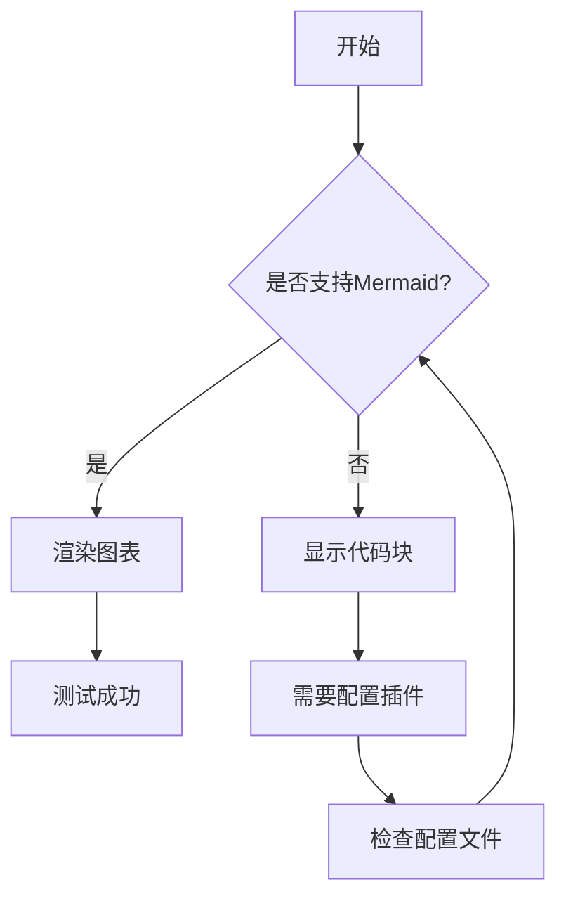
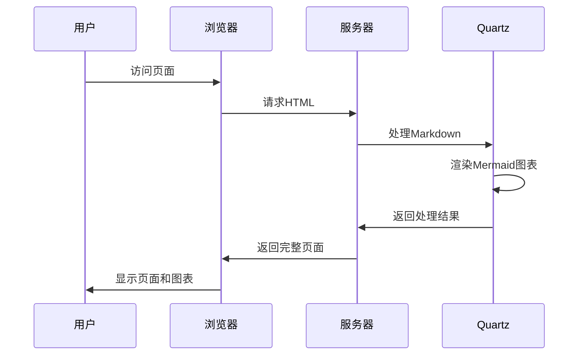
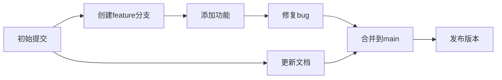
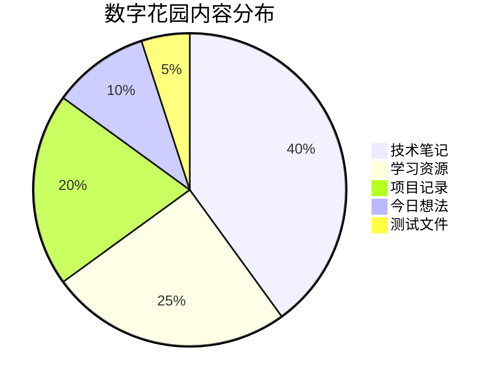
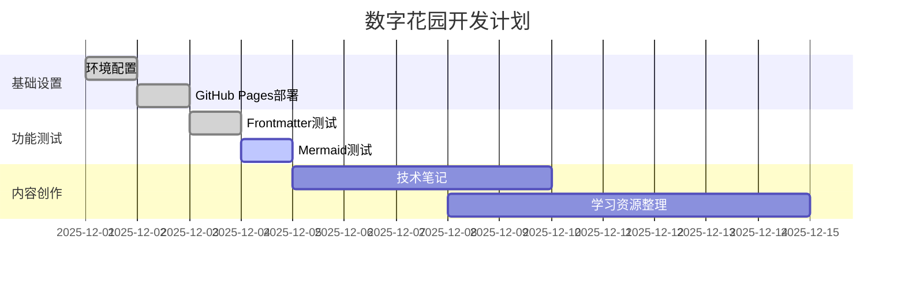
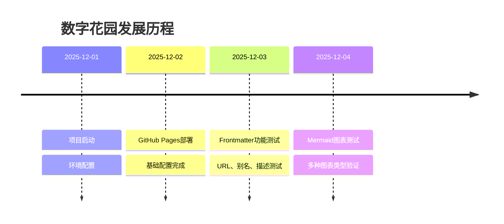
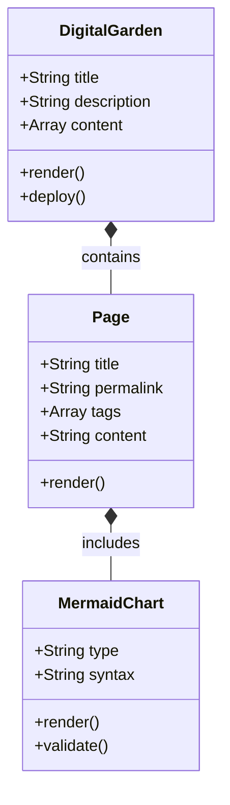

# 测试Mermaid图表功能

## 🎯 测试目标

这个页面用于测试 Quartz 的 Mermaid 图表渲染功能。

## 📊 图表类型测试

### 1. 流程图 (Flowchart)

### 2. 序列图 (Sequence Diagram)

### 3. Git图 (Git Graph)

### 4. 饼图 (Pie Chart)

### 5. 甘特图 (Gantt Chart)

### 6. 时间线 (Timeline)

### 7. 类图 (Class Diagram)

## 🔍 验证方法

### 预期结果
- ✅ 所有图表应该正确渲染为可视化图形
- ✅ 图表应该适配网站主题色彩
- ✅ 图表应该具有交互性（如果支持）

### 如果图表未显示
1. 检查是否显示为普通代码块
2. 确认 `ObsidianFlavoredMarkdown` 插件已启用
3. 确认插件顺序：`SyntaxHighlighting` 在 `ObsidianFlavoredMarkdown` 之前

## 🔗 相关链接

- [[技术笔记]]
- [Mermaid官方文档](https://mermaid.js.org/)
- [Quartz Mermaid支持说明](_docs/features/Mermaid diagrams.md)

---

*如果上面的图表都能正确显示，说明 Mermaid 功能正常工作！*